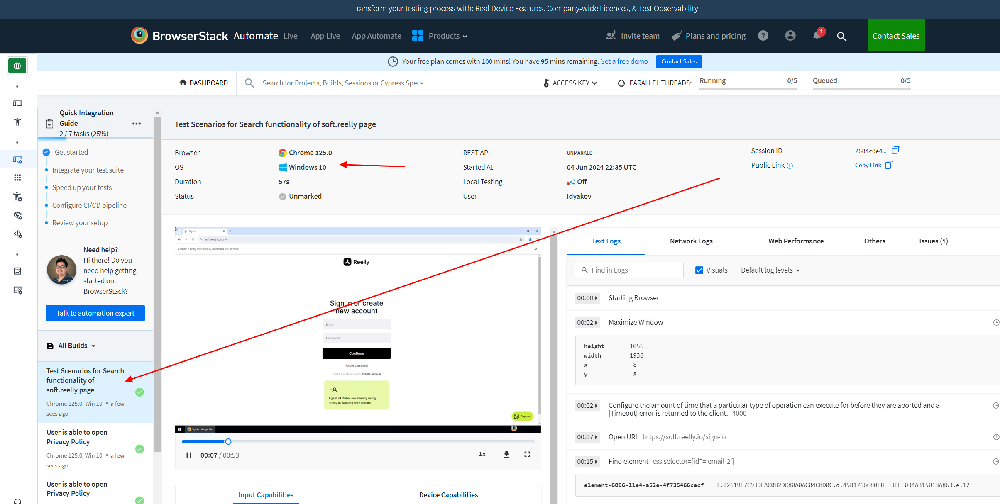
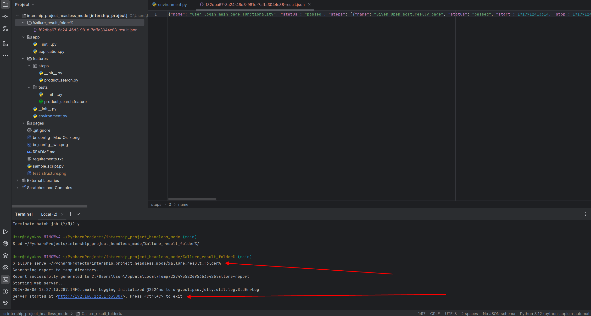
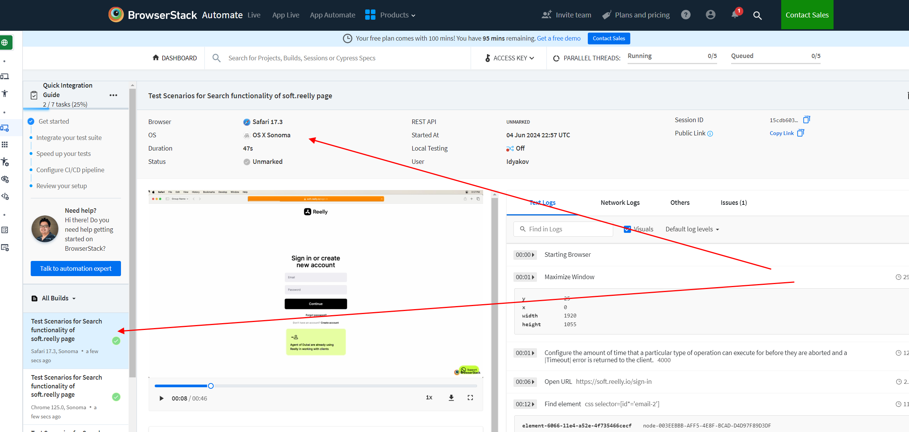

Allure setup console_configuration

allur_ui_report

Browserstalk_Windows_cloud_config_test

Browserstalk_Mac_cloud_config_test

Feature: Test Scenarios for Search functionality of soft.reelly page

  Scenario: User login main page functionality

    1. Given Open soft.reelly page
    2. And Login to the page
    3. And Click on continue button
    4. And Click on settings open
    5. And Click on Edit profile option
    6. And Enter some test information in the input fields
    7. And Click on Save changes
    8. And Check the right information is present in the input fields
    9. And Click on Close
#
